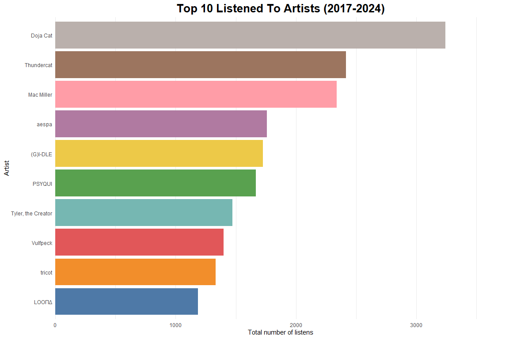
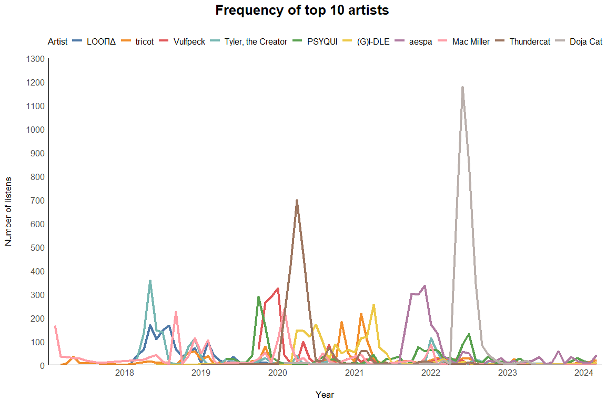
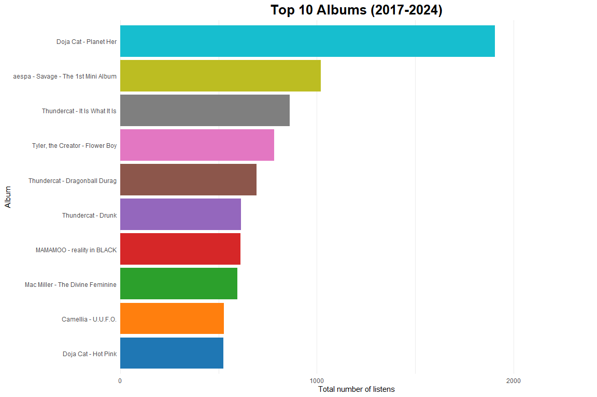
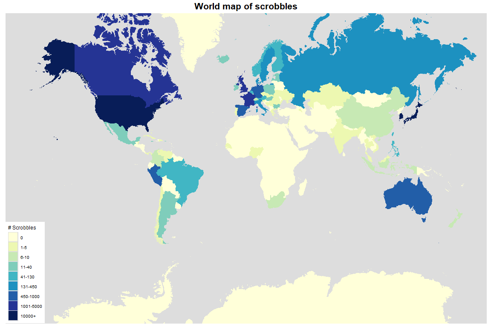
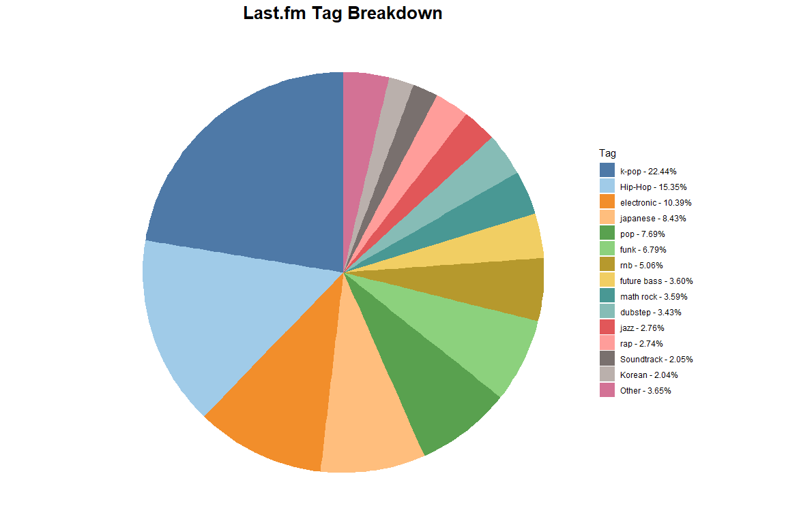
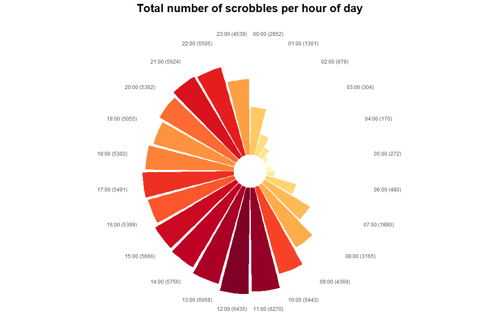
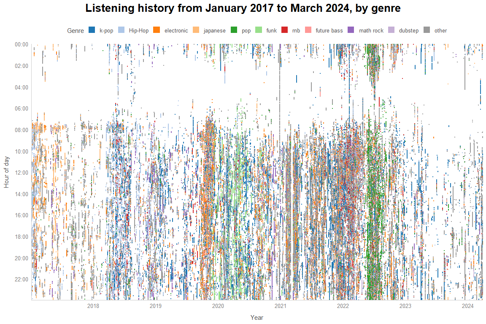

+++
title = "A Tour of My Listening History"
date = "2024-04-01"

[taxonomies]
tags = ["school", "project"]
+++

# Disclaimer
This was a major assignment for the course CSCI4210U (Information Visualization). I think I might have done too much work on this, but I still enjoy having it up as an archive of the listening habits I had before I started a personal project to listen to more music. 

# Terminology
- **last.fm**: A music tracker site that creates a profile of your music taste over a period of time, keeping records of all the songs you listen to (as long as you link your music player of choice to it). [Wikipedia article](https://en.wikipedia.org/wiki/Last.fm)
- **MusicBrainz**: An online, open source database of music. Keeps track of artists, their songs, and relationships between them (yet this isn't entirely up to date). Also has information such as the artist's country and every physical/digital release they have. [Wikipedia article](https://en.wikipedia.org/wiki/MusicBrainz)
- **Scrobble**: A record of a listen of a song. Includes all the song's metadata, as well as the time the song was listened.

# Introduction
Music has been a big part of my life. My mother told me that she would play music for me before I was even born, and every day ever since has not been without at least one song playing\*. I thought I would want to keep track of how my taste and habits change over time, as I get into new rhythm games and learn about new artists from my friends. I would also like to see how much my life has changed just entirely based on the music I listened to at certain times.

To do this, I have decided to take all of my data from my [last.fm profile](https://www.last.fm/user/emperte) via an external site that converts my listening history to a .csv file (<https://lastfm.ghan.nl/export/>). For any auxiliary information (such as artist country), I took from [MusicBrainz's database](https://musicbrainz.org/) and made more API requests to Last.fm for artist tags. I stitched the auxiliary information together on Python, the process of which can be seen in the `python_data_wrangling` folder of [this repo](https://github.com/fenreese/CSCI4210-assignment/tree/main/python_data_wrangling).

This data may not be the most accurate, as it only has records of listening habits from 2017-01-02 13:17:31 GMT-5 to 2024-03-27 12:55:50 GMT-4. (As I type this, I am listening to music...)

## Questions To Explore
1. What genres, or in Last.fm's case, "tags" do I listen to the most?
	- When have I listened to each genre/tag the most throughout my listening history?
2. When do I tend to listen to music the most?
3. Which country's music have I listened to the most?
4. What are my top 10 artists and albums?
	- Is there a reason why these artists/albums are in my top 10?

These questions will be explored in reverse order. I would like to thank and give credits to these websites for inspiration on these graphs:

- Hot One Hundo's blog posts on last.fm visualization ([here](https://hotonehundo.wordpress.com/2018/01/11/last-fm-visualization-tools/) and [here](https://hotonehundo.wordpress.com/2018/02/10/last-fm-advanced-scrobbling-statistics/))
- [Scatter.FM](https://scatterfm.markhansen.co.nz/graph.html#/user/emperte)
- [Explr.fm](https://mold.github.io/explr/?username=emperte)

## The Data Itself
Here is an explanation of the columns of the data I'm working with.

| Name          | Description                                                                                               |
|---------------------|---------------------------------------------------|
| `uts`         | The Unix epoch timestamp (how many seconds since 1970-01-01 00:00:00 UTC) of when the song was scrobbled. |
| `utc_time`    | The human-readable time of when the song was scrobbled.                                                   |
| `artist`      | The artist of the song.                                                                                   |
| `artist_mbid` | The MusicBrainz ID of the artist.                                                                         |
| `album`       | The album the song belongs in.                                                                            |
| `album_mbid`  | The MusicBrainz ID of the album (referred to in MB as "release")                                          |
| `track`       | The name of the song.                                                                                     |
| `track_mbid`  | The MusicBrainz ID of the song (referred to in MB as "track")                                             |

# The Charts

## Top Artists
I feel like I'll be surprised by this data, as I feel like I've changed a lot over the years.

Seeing all of these artists has helped me realize that I tend to go through phases where I listen to a lot of one artist, get burnt out of listening to them, and then never listen to them again. (I believe out of these 10, the only artists I still regularly listen to are aespa, (G)I-DLE, PSYQUI, and tricot.) To see if this is true, I'll plot a line graph of listens of my Top 10 artists per month.

As I thought, there are spikes in my listening activity, backing up my hypothesis. I can list some important spikes:

- Tyler, the Creator: early 2018 (figuring myself out, listened to nothing but [Flower Boy](https://en.wikipedia.org/wiki/Flower_Boy). I'm nonbinary by the way.)
- Mac Miller: late 2018 (he died September 7, 2018; rest in peace) and early 2020 (release of [Circles](https://en.wikipedia.org/wiki/Circles_(Mac_Miller_album)))
- Vulfpeck: late 2019 (got together with my ex, who got me into the band)
- Thundercat: early 2020 (release of [It Is What It Is](https://en.wikipedia.org/wiki/It_Is_What_It_Is_(Thundercat_album)))
- aespa: late 2021 - early 2022 (broke up with my ex, release of the [Savage mini-album](https://en.wikipedia.org/wiki/Savage_(EP)))
- Doja Cat: mid 2022 (Kiss Me More was a good song)

## Top 10 Albums
Out of sheer curiosity, I wondered if all of my top 10 listened albums were from my top 10 artists.

Only two albums out of 10 were not from a top 10 artist of mine, and only half of my top 10 artists made an album that was in my top 10 albums. I personally think [reality in BLACK](https://en.wikipedia.org/wiki/Reality_in_Black) is Mamamoo's best album (stream [HIP](https://www.youtube.com/watch?v=KhTeiaCezwM)). I think U.U.F.O. made it in because the album has [one of the longest song titles known to myself](https://www.youtube.com/watch?v=LnkfOVHkVfo), and I like putting horribly long song names in my listening history.

## Top Countries
I wanted to know what countries the music I listened to came from, and expected to have a lot of scrobbles of songs of artists from United States, Korea, and Japan.

As I was gathering this information, I noticed that either the MusicBrainz database is lacking in country information for a lot of artists, or my scrobble history database is lacking in MusicBrainz IDs for a lot of artists. As such, this may not be the most accurate.

It definitely shows that I am a big fan of Western pop, K-pop, and Japanese EDM. There were some things that surprised me though. I'm surprised I listen to a decent amount of Australian, Spanish, and French musicians. I also, for some reason, have a surprising amount of listens to Russian musicians.

The scale I used may not be the most conventional, but that's mainly because the data is too extreme (only around 5 countries had so many listens, the rest had less than 5000).

This chart was inspired by [Explr.fm](https://mold.github.io/explr/?username=emperte).

## Top Genres/Tags
Some notes:

- Last.fm has a public API, but there is a limit of [100mb per API token, as shown in the TOS, section 4.3.4](https://www.last.fm/api/tos). I was afraid I would reach that limit knowing I have around 13k unique artist/song combinations, so I had to take shortcuts and get the top genre of an artist instead of a song. This is also why I didn't want to re-do this process, even though there are a few problems with the data detailed in the next point. 
- As I was gathering the data for this, I realized that last.fm doesn't have a "genre", but more a "top tag". This threw me off a little - the top tags for some artists are very weird (example at the time: KAYTRANADA's top tag is "seen live" when I got the top tags; this messed up my info because now his top tag is "electronic").
  - There is also no consistency with tags on Last.fm; there is a `Kpop` and a `k-pop` tag that describes the same genre.
- The sum of all scrobbles with artist tags is ~68,000, and I don't know why, because with how I coded this, the sum should be ~95,000.

Wow, I listen to a lot of K-pop groups and soloists (and this probably isn't all of it because of the tag consistencies). I'm assuming the hip-hop comes from all the Tyler, the Creator, Kendrick Lamar, and Mac Miller I listened to over the years. 

I think there's probably an overlap with some of these tags - I mentioned I listened to a lot of Japanese EDM, and "japanese" and "electronic" are two different tags. I also find it amusing how, even though Doja Cat is my #1 artist, (western) pop is only around 7% of the music I listen to.

## Listening Activity By Time
I have no concept of time, so my hypothesis is that I listen to music most when I'm most awake.

From my all-time stats, I tend to listen to music often from 11:00am to 10:00pm, and not so much when I'm asleep (from around 1:00am to 8:00am). This makes sense, as I tend to be productive during these hours. I'm shocked that I listened to the most music at 12:00pm though, as I would assume I eat lunch during that time. 

This chart was inspired by Last.fm's own "Listening Clock" graph (which I am no longer able to show as it's a Last.fm Pro feature and I am no longer subscribed to it), which is probably more representative of my work schedule lately. It shows I tend to listen to music in the late afternoon/evening, which makes sense because lately I've been waking up at 10:00am, only to not do schoolwork until 2:00pm, then stop at 7:00pm.

## Song Tag Scatterplot
The last thing I wanted to know was if I could have a finer breakdown of what music I listened to over the years. For the sake of having readable colours for such a big plot, I had to reduce the number of genres from 14 to 10. All of the caveats from the prior "tag" chart also apply to this one.

\*Turns out what I said in my introduction wasn't true after all. There are some gaps in the plot from what I assume is no music activity.

You can see that I didn't really ramp up with listening to music until late 2019, in which I decided to scrobble a lot until mid-2022. Funnily enough, it looks like my big streak of music listening starts with a dense period in late 2019, becomes less dense in between (but still more so compared to 2017 and 2023), then ends with a very dense period in mid-2022. 

There is a streak of orange in late 2019, probably based on a streak I had of listening to Japanese EDM. Additionally, If I'm correct, the period between the end of 2021 and the beginning of 2022 has me scrobbling a mix of different genres (presumably, to get over my ex breaking up with me). It's funny to me that I see a lot of green around the time I listened to nothing but Doja Cat (mid-2022).

There is one caveat with having only 10 visible genres; it doesn't show my current synthpop phase. Lately, I've been listening to a lot of [Magdalena Bay](https://en.wikipedia.org/wiki/Magdalena_Bay_(band)), but you wouldn't know because synthpop is one of the "other" tags. It also doesn't help with the one day I left my Spotify on playing Italian death metal band [Fleshgod Apocalypse](https://en.wikipedia.org/wiki/Fleshgod_Apocalypse) at the end of 2020.

This scatterplot was inspired by [Scatter.FM](https://scatterfm.markhansen.co.nz/graph.html#/user/emperte).

# Summary

- I tend to go through phases of listening to artists a lot for a period of time, and then never listening to them again.
- I slowly started listening to more music starting in late 2019 and ending in mid-2022. I listened to the least music in 2023.
- I listen to a lot of American pop, Korean pop, and Japanese EDM.
- I listen to music the most during the afternoon and early evening.